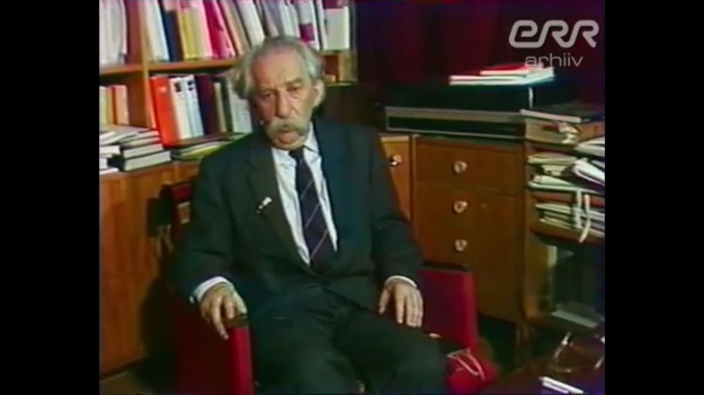

### [27 из 33] Юрий Лотман — Искусство как форма мышления

[https://youtu.be/KmxFLGRhg2c?si=EaB52n5XunYB6hF5](https://youtu.be/KmxFLGRhg2c?si=EaB52n5XunYB6hF5)

Полный цикл лекций «Беседы о русской культуре» академика Юрия Михайловича Лотмана.Лекция №27. Искусство как форма мышления.Дата выпуска: 26.05.1990

