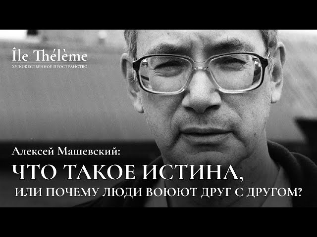

# «Что такое истина, или почему люди воюют друг с другом?» | Лекция Алексея Машевского

Третья из трех мировоззренческих лекций Алексея Машевского, прочитанная в пространстве Île Thélème 4 марта 2023 года. 

Когда-то давно человек придумал культуру. И придумал её не просто так, а для того, чтобы она спасла его от тотальности окружающего природного мира. В рамках культурной матрицы вся информация, воспринимаемая человеком, оказывается структурированной. В каждой культуре это структурирование происходит в соответствии с определенной иерархией ценностей, в которой высшую позицию занимает та или иная интуиция истинного.
В то же время, как ни странно, существование в культуре, собственно, и делающее человека человеком, чревато серьезными опасностями. Просто потому, что культур много, и исповедуя разные ценности, они приходят в конфликт друг с другом. Именно идеологические противоречия становятся зачастую источником войн. Кроме того, задавая определенную иерархию значимого, традиционная культура явно или неявно контролирует образ мыслей и поведение личности, подавляя не вписывающиеся в норму проявления человеческой уникальности.

Каким же образом, учитывая эти обстоятельства, разные цивилизации и люди принадлежащие той или иной культурной традиции, могут сосуществовать и преодолевать возникающие противоречия? Размышлениями по этому поводу и постарается поделиться лектор.

