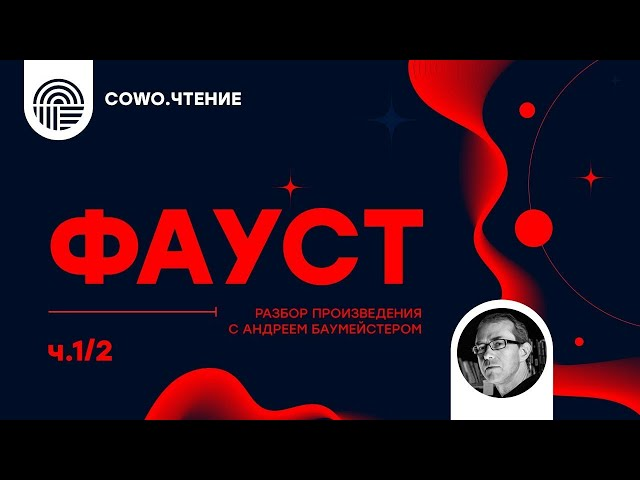

# Фауст: главный миф Европы. Часть 1/2

Философская беседа о главных идеях "Фауста" Гете. Фауст как реальная личность. Легенды о докторе Фаусте. Как Гете создавал своего "Фауста"? История доктора Фауста - главный миф Европы. О русском и украинском переводе Фауста. Борис Пастернак и Мыкола Лукаш. Преимущества и недостатки русского и украинского переводов.

